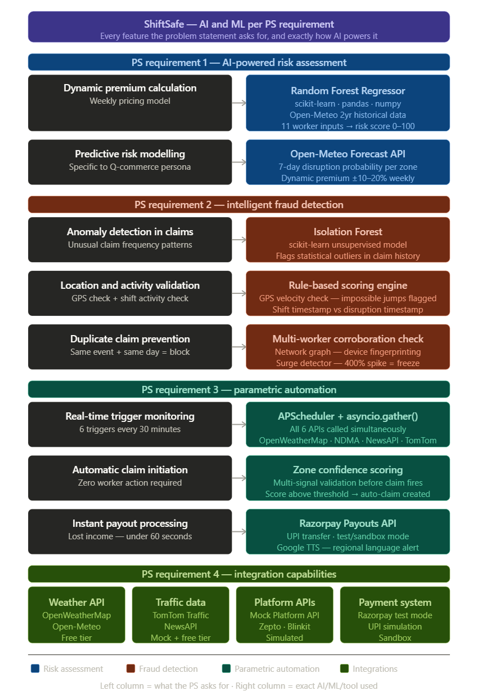

# ShiftSafe 🛡️
### *"Rain shouldn't stop your income"*
**AI-Powered Parametric Income Insurance for India's Q-Commerce Delivery Workers**


📁 **GitHub Repository:** [https://github.com/rakshiga06/ShiftSafe-your-income-protected.git](https://github.com/rakshiga06/ShiftSafe-your-income-protected.git)
🎥 **Demo Video (Phase 1):** [https://youtu.be/YOUR_VIDEO_ID](https://youtu.be/YOUR_VIDEO_ID)

---

## 📌 Table of Contents
1. [The Problem](#the-problem)
2. [Our Solution](#our-solution)
3. [Our User Persona](#user-persona)
4. [How It Works](#how-it-works)
5. [Parametric Triggers](#parametric-triggers)
6. [Weekly Premium Model](#weekly-premium-model)
7. [AI/ML Integration Plan](#aiml-integration-plan)
8. [Fraud Detection](#fraud-detection)
9. [Why Web Application](#why-web-application)
10. [Tech Stack](#tech-stack)
11. [System Architecture](#system-architecture)
12. [Key Features](#key-features)
13. [6-Week Development Plan](#6-week-development-plan)
14. [Repository Structure](#repository-structure)
15. [Team](#team)

---

## 🔴 The Problem

India's Q-Commerce delivery workers — the people delivering groceries, medicines, and daily essentials in 10 minutes via **Zepto, Blinkit, and Swiggy Instamart** — are among the most financially vulnerable workers in the country.

External disruptions such as heavy rain, floods, extreme heat, severe pollution, zone shutdowns, and platform outages can reduce their working hours to zero instantly. Unlike food delivery workers who can wait out mild rain, Q-commerce workers operate on **10-minute SLAs** — even moderate rain immediately halts order allocation on their platforms.

When disruptions occur, they lose **₹400–700 per day** with absolutely no protection.

### The Numbers

| Fact | Data |
|------|------|
| Gig delivery workers in India | 5 million+ |
| Q-commerce deliveries per worker per day | 35–40 |
| Income lost per rain day | ₹400–700 |
| Income lost per monsoon season | ₹6,000–12,000 |
| Existing payout speed (SEWA's solution) | 6–8 weeks |
| Products built specifically for Q-commerce workers | **Zero** |

### Why Q-Commerce Workers Are MORE Vulnerable Than Food Delivery

- **The 10-minute trap** — Even moderate rain (20mm) immediately stops order allocation. Food delivery workers can wait it out. Q-commerce workers cannot — their entire business model is speed.
- **Dark store dependency** — Workers are tied to fixed dark store locations. If their zone floods or shuts down, they cannot simply move to another area like food delivery workers can.
- **Multi-platform income loss** — A single disruption simultaneously stops orders on Zepto, Blinkit, AND Swiggy Instamart. All income streams go to zero at once.
- **Night shift vulnerability** — Q-commerce runs 24/7. Workers on 10pm–4am shifts face unexpected weather with zero platform support.
- **Platform outage vulnerability** — Unlike food delivery workers who can switch restaurants, Q-commerce workers depend entirely on their platform app. When Zepto or Blinkit goes down, the worker shows up to his dark store, is ready to work, but earns absolutely nothing. This is 100% outside his control.

### What Exists Today Is Not Enough

SEWA's parametric heat insurance covers 50,000 workers but:
- Takes **6–8 weeks** to pay out
- Covers **heat only** — no rain, no floods, no pollution, no outages
- Has **no app, no AI, no automation**
- Is **not built** for delivery workers specifically

> There is no product for India's Q-commerce delivery workers. **ShiftSafe builds it.**

---

## 💡 Our Solution

ShiftSafe is a **mobile-responsive web application** that provides AI-enabled parametric income insurance specifically designed for Q-commerce delivery workers on Zepto, Blinkit, and Swiggy Instamart.

### The Core Promise

> *"Arjun pays ₹89/week. The moment our system detects heavy rain in his dark store zone, a claim is automatically created and ₹400 is sent to his UPI — in under 60 seconds. He didn't press anything. He didn't call anyone. It just happened."*

### What Makes ShiftSafe Different

| Feature | Existing Solutions | ShiftSafe |
|---|---|---|
| Payout Speed | 6–8 weeks | Under 60 seconds ⚡ |
| Triggers Covered | Heat only | 6 disruption types |
| AI Pricing | None | ML-powered personalised pricing |
| Fraud Detection | None | AI-powered 5-layer system |
| Built for Q-Commerce | No | Yes — dark store zone mapping |
| Platform Outage Coverage | No | Yes — unique to ShiftSafe 🌟 |
| Language Support | English only | Tamil, Hindi, Kannada, Telugu, English |
| Pricing Model | Annual flat fee | Weekly — matches gig earning cycle |
| Shift Awareness | No | Yes — coverage only during active shifts |
| Multi-platform Coverage | No | Zepto + Blinkit + Instamart combined |
| Budget Awareness | No | ML respects worker's weekly budget |

### How It Works In 3 Steps

**Step 1 — Smart Onboarding (3 minutes)**
Worker answers 13 targeted questions across 5 simple screens. ML model combines their answers with 2 years of dark store zone weather history to calculate a personalised weekly premium. Worker sees the AI's reasoning and activates their plan.

**Step 2 — Stay Protected**
Worker pays weekly and taps "Start Shift" when they begin working. ShiftSafe watches their dark store zone 24/7 — weather, traffic, news, and platform status simultaneously.

**Step 3 — Get Paid Automatically**
The moment a disruption is detected:
- ✅ Claim auto-created
- ✅ Fraud check runs (under 5 seconds)
- ✅ Payout sent to UPI (under 60 seconds)
- ✅ Worker notified in their language
- ✅ Worker does absolutely nothing

### The 6 Disruptions ShiftSafe Covers

| # | Disruption | Example |
|---|---|---|
| 1 | 🌧️ Heavy Rain | Rainfall ≥ 20mm stops 10-min deliveries |
| 2 | 🌊 Flood Alert | Zone waterlogging halts dark store operations |
| 3 | 🌡️ Extreme Heat | 45°C+ makes 35–40 deliveries/day dangerous |
| 4 | 😷 Severe Pollution | AQI ≥ 300 — dangerous for high-frequency riders |
| 5 | 🚫 Zone Shutdown | Bandh/curfew blocks dark store access |
| 6 | 📱 Platform Outage | Zepto/Blinkit/Instamart app down — zero orders |

### Market Opportunity

| Metric | Number |
|---|---|
| Q-commerce delivery workers in India | 5 million+ |
| Market growth rate | 30% year on year |
| Q-commerce market value (2024) | $3.34 billion |
| Projected market value (2029) | $10 billion |
| Revenue at 1% market capture | ₹20 crore+ annually |

---

## 👤 User Persona
## Our Chosen Persona

We chose **Q-Commerce delivery partners** — workers
delivering for Zepto, Blinkit, and Swiggy Instamart.

Out of all delivery categories, Q-commerce workers
are the most financially vulnerable and the most
completely ignored by every existing insurance product.

We chose Q-commerce because they need ShiftSafe the
most, they are underserved the most, and the problem
is most precisely solvable for them. The specificity
of their work pattern — fixed dark stores, 10-minute
SLAs, multi-platform dependency — actually makes our
AI more accurate, our triggers more precise, and our
fraud detection more reliable than it would be for
any other delivery persona.

### Meet Arjun 👦

| Detail | Info |
|---|---|
| Name | Arjun Kumar |
| Age | 22 |
| City | Bangalore |
| Platforms | Zepto, Blinkit, Swiggy Instamart |
| Dark Stores | HSR Layout, Koramangala, BTM Layout |
| Working Hours | 10–12 hours/day, 6 days/week |
| Deliveries/Day | 35–40 on a good day |
| Weekly Earnings | ₹3,500–4,500 (across all platforms) |
| Savings | Less than ₹2,000 |
| Phone | Cheap Android, Kannada as default language |
| Family | Sends ₹8,000/month home to rural Karnataka |

### Arjun's Typical Day

| Time | Activity |
|---|---|
| 6:00 AM | Wakes up, checks all 3 platform apps for order demand |
| 7:00 AM | Reaches HSR Layout dark store, starts first shift |
| 9:00 AM | Switches to Koramangala dark store (higher demand) |
| 1:00 PM | Lunch break (30 minutes) |
| 2:00 PM | Back on shift at BTM Layout dark store |
| 6:00 PM | Peak hour — 8–10 deliveries per hour |
| 9:00 PM | Shift ends, counts earnings for the day |

**Good day: ₹700 | Average day: ₹550 | Rain day: ₹0**

### ❌ What Happens When It Rains (Without ShiftSafe)

```
3:00 PM — Rain starts in Bangalore
3:05 PM — All 3 platforms reduce order allocation immediately
3:10 PM — Arjun's app shows zero new orders
3:15 PM — Dark store manager says "Wait outside, no dispatches"
3:15 PM – 6:30 PM → Arjun sits under a shed. Earns ₹0.

Lost income: ₹450–600. Nobody compensates him. It is simply gone.
```

This happens **15–20 times every monsoon season**. Total seasonal loss: ₹6,000–12,000. Arjun's total savings: ₹2,000.

### ✅ What Happens When It Rains (With ShiftSafe)

```
3:00 PM — Rain starts in Bangalore
3:05 PM — ShiftSafe detects rainfall crossing 20mm in HSR Layout
3:05 PM — System checks: Is Arjun on active shift? ✅
3:05 PM — 5-layer fraud detection runs automatically ✅
3:06 PM — Claim approved ✅
3:06 PM — ₹400 sent to Arjun's UPI ✅
3:06 PM — Phone buzzes (in Kannada):
           "ಭಾರೀ ಮಳೆ ಪತ್ತೆಯಾಗಿದೆ. ₹400 ನಿಮ್ಮ UPI ಗೆ ಜಮಾ ಆಗಿದೆ ⚡"
           (Heavy rain detected. ₹400 credited to your UPI ⚡)

Total time from detection to payout: Under 60 seconds.
Arjun did nothing. It just happened.
```

### What ShiftSafe Costs Arjun

```
Weekly premium (Standard plan): ₹89/week = ₹12.71 per day
= Less than one cup of chai ☕

Over monsoon season (4 months):
  Premium paid:    ₹1,424
  Claims received: ₹6,000–8,000
  Net benefit:    +₹4,576–6,576 ✅
```

### Why Arjun Has Never Had Insurance Before

- Every existing insurance product is monthly or annual — he cannot afford to lock money that long
- Every existing product requires filing claims manually — he doesn't have time or literacy for paperwork
- No existing product is available in Kannada
- No existing product understands that 20mm rain = zero income for a Q-commerce worker
- No existing product covers platform outages

> ShiftSafe is the first product built around how Arjun actually lives and works.

---

## 🔄 How It Works

### Complete Application Flow

```
━━━━━━━━━━━━━━━━━━━━━━━━━━━━━━━━━━━━━━━━
STEP 1 — SMART ONBOARDING (3 minutes)
━━━━━━━━━━━━━━━━━━━━━━━━━━━━━━━━━━━━━━━━

Worker opens ShiftSafe on phone browser
↓
Answers 13 questions across 5 simple screens:

  Screen 1 — Identity (Name, Phone, City)
  Screen 2 — Work Setup (Platforms, Dark stores, Days/week, Shift)
  Screen 3 — Earnings & Budget (Weekly income slider, Budget slider)
  Screen 4 — Risk Profile (Savings level, Disruption frequency, Past disruption types)
  Screen 5 — UPI Details (For instant payouts)

↓
ML Risk Scorer runs automatically:
  - Pulls 2 years weather history for each dark store zone
  - Combines zone data with all 13 answers
  - Calculates personalised risk score (0–100)
  - Checks against worker's stated weekly budget
  - Recommends optimal plan with full explanation
↓
Worker sees AI recommendation with reasoning:
  "Based on your zones and work pattern,
   we recommend Standard ₹89/week because..."
↓
Worker activates plan → Pays via Razorpay UPI
↓
Policy activated instantly ✅

━━━━━━━━━━━━━━━━━━━━━━━━━━━━━━━━━━━━━━━━
STEP 2 — SHIFT CHECK-IN (every working day)
━━━━━━━━━━━━━━━━━━━━━━━━━━━━━━━━━━━━━━━━

Worker opens ShiftSafe → Taps "Start Shift"
↓
Selects which dark store they are at today
Selects which platforms are active today
↓
Coverage activates for that zone

Note: Coverage is ONLY active during registered shift hours.
This prevents fraud and ensures payouts only go to workers actually working.

━━━━━━━━━━━━━━━━━━━━━━━━━━━━━━━━━━━━━━━━
STEP 3 — CONTINUOUS MONITORING (automated)
━━━━━━━━━━━━━━━━━━━━━━━━━━━━━━━━━━━━━━━━

Every 30 minutes, ShiftSafe backend checks ALL 6 triggers
for every active dark store zone:

  🌧️ OpenWeatherMap API     → rainfall mm
  🌊 Open-Meteo + NDMA      → flood alerts
  🌡️ OpenWeatherMap API     → temperature
  😷 OpenWeatherMap API     → AQI levels
  🚫 NewsAPI + Traffic API  → zone shutdown
  📱 Mock Platform API      → app outage status

No human involvement. Runs 24/7/365.

━━━━━━━━━━━━━━━━━━━━━━━━━━━━━━━━━━━━━━━━
STEP 4 — DISRUPTION DETECTED
━━━━━━━━━━━━━━━━━━━━━━━━━━━━━━━━━━━━━━━━

Example: Rainfall crosses 20mm in HSR Layout
System automatically:
  1. Identifies trigger      → HEAVY RAIN
  2. Identifies zone         → HSR Layout
  3. Finds all eligible workers:
     Active policy ✅ + Active shift ✅ + Zone match ✅
  4. Creates claim for each eligible worker

━━━━━━━━━━━━━━━━━━━━━━━━━━━━━━━━━━━━━━━━
STEP 5 — FRAUD DETECTION (under 5 seconds)
━━━━━━━━━━━━━━━━━━━━━━━━━━━━━━━━━━━━━━━━

  Layer 1: Location valid?           (+40 pts if failed)
  Layer 2: Shift active?             (+25 pts if failed)
  Layer 3: Duplicate claim?          (+20 pts if failed)
  Layer 4: Frequency anomaly?        (+15 pts if failed)
  Layer 5: Multi-worker corroboration? (+10 pts if failed)

  Score < 30  → AUTO APPROVE ✅
  Score 30–60 → MANUAL REVIEW ⚠️
  Score > 60  → AUTO REJECT ❌

━━━━━━━━━━━━━━━━━━━━━━━━━━━━━━━━━━━━━━━━
STEP 6 — INSTANT PAYOUT (under 60 seconds)
━━━━━━━━━━━━━━━━━━━━━━━━━━━━━━━━━━━━━━━━

  Claim approved
  ↓
  Razorpay Payout API triggered
  ↓
  ₹400 sent to Arjun's registered UPI ID
  ↓
  Push notification sent in Kannada
  ↓
  Family notification sent (if enabled)
  ↓
  Claim status updated to PAID in app

  Total time: Under 60 seconds ⚡

━━━━━━━━━━━━━━━━━━━━━━━━━━━━━━━━━━━━━━━━
STEP 7 — WEEKLY AUTO RENEWAL
━━━━━━━━━━━━━━━━━━━━━━━━━━━━━━━━━━━━━━━━

  Every Sunday midnight:
    Premium auto-deducted
    New week coverage activated

  Monday morning — weekly forecast card sent:
    HSR Layout:    🌧️ Rain Risk HIGH (82%)
    Koramangala:   🌧️ Rain Risk MEDIUM (45%)
    BTM Layout:    🌧️ Rain Risk HIGH (78%)
```

---

## ⚡ Parametric Triggers

ShiftSafe monitors **6 disruption triggers** every 30 minutes for every active dark store zone. All thresholds are specifically tuned for Q-commerce workers.

> **Why our thresholds are different from standard insurance:** Standard parametric insurance uses 50mm as the rain trigger. ShiftSafe uses **20mm** — because even moderate rain immediately destroys a 10-minute delivery SLA. This is the core Q-commerce insight no existing product has acted on.

### Trigger 1 — 🌧️ Moderate to Heavy Rain

| Detail | Value |
|---|---|
| Detection API | OpenWeatherMap + Open-Meteo (cross-validated) |
| Threshold | Rainfall ≥ 20mm in dark store zone |
| Why Q-Commerce specific | 20mm rain = immediate halt of 10-min SLA orders |
| Payout (20–49mm) | ₹400 |
| Payout (50–79mm) | ₹500 |
| Payout (80mm+) | ₹700 |

### Trigger 2 — 🌊 Flood / Waterlogging Alert

| Detail | Value |
|---|---|
| Detection source | NDMA RSS feed + IMD alerts + rainfall > 80mm |
| Threshold | Official flood alert OR rainfall > 80mm |
| Why Q-Commerce specific | Dark stores in low-lying areas shut completely |
| Payout | ₹700 |

### Trigger 3 — 🌡️ Extreme Heat

| Detail | Value |
|---|---|
| Detection API | OpenWeatherMap current weather |
| Threshold | Temperature ≥ 45°C |
| Why Q-Commerce specific | 35–40 deliveries/day in 45°C is dangerous |
| Payout | ₹300 |
| Active hours | 10am–5pm only (peak heat hours) |

### Trigger 4 — 😷 Severe Pollution

| Detail | Value |
|---|---|
| Detection API | OpenWeatherMap Air Pollution API + IQAir |
| Threshold | AQI ≥ 300 (Hazardous) |
| Why Q-Commerce specific | High-frequency riding = extreme pollution exposure |
| Payout | ₹250 |

### Trigger 5 — 🚫 Zone Shutdown

| Detail | Value |
|---|---|
| Detection source | NewsAPI + TomTom Traffic API + Confidence scoring |
| Threshold | Confidence score > 60 |
| Keywords monitored | bandh, curfew, strike, section 144, hartal (in 5 languages) |
| Why Q-Commerce specific | Worker cannot physically access dark store |
| Payout | ₹500 |

**3-layer confidence scoring:**
```
NewsAPI keyword detection    → +40 points
TomTom roads empty/blocked   → +40 points
Government alert issued      → +20 points

Score > 60  → Trigger fires ✅
Score 40–60 → Manual review ⚠️
Score < 40  → Not enough evidence ❌
```

### Trigger 6 — 📱 Platform App Outage

| Detail | Value |
|---|---|
| Detection source | Mock Platform Status API (simulated) |
| Threshold | Platform status = "outage" for worker's active platform |
| Platforms monitored | Zepto, Blinkit, Swiggy Instamart |
| Why Q-Commerce specific | Workers depend 100% on platform app — outage = zero orders |
| Payout | ₹300 |

> **Note:** This trigger is unique to ShiftSafe. No existing insurance product covers platform outages. Phase 3 roadmap includes DowndetectorAPI integration for real-time detection.

### All 6 Triggers — Summary

| # | Trigger | Condition | Detection | Payout |
|---|---|---|---|---|
| 1 | 🌧️ Rain | ≥ 20mm | OpenWeatherMap + Open-Meteo | ₹400–700 |
| 2 | 🌊 Flood | Alert OR ≥ 80mm | NDMA RSS + IMD | ₹700 |
| 3 | 🌡️ Heat | ≥ 45°C | OpenWeatherMap | ₹300 |
| 4 | 😷 Pollution | AQI ≥ 300 | OpenWeatherMap + IQAir | ₹250 |
| 5 | 🚫 Shutdown | Confidence > 60 | NewsAPI + TomTom + Govt | ₹500 |
| 6 | 📱 Outage | Platform down | Mock Platform API | ₹300 |

### What ShiftSafe Does NOT Cover

```
❌ Health insurance
❌ Accident medical bills
❌ Vehicle repairs
❌ Life insurance
❌ Claims during non-shift hours
❌ Disruptions outside registered dark store zone
❌ Personal losses unrelated to work

ShiftSafe covers ONE thing only:
💰 LOST INCOME during external disruptions while the worker is on an active shift.
```

---

## 💰 Weekly Premium Model

### Why Weekly Pricing?

Most insurance products in India are priced monthly or annually. For Q-commerce delivery workers, this model is completely inaccessible:
- They earn **day by day** — no monthly salary
- They have **no savings buffer** to pay upfront
- Their income **fluctuates weekly**

> *"A ₹89/week premium feels manageable. A ₹356/month premium feels like a luxury. Same amount. Completely different psychology."*

### Smart Onboarding — 13 Questions ML Uses

| # | Question | What ML Uses It For |
|---|---|---|
| 1 | Name | Account identification |
| 2 | Phone number | OTP login + payout notifications |
| 3 | City | Dark store search |
| 4 | Platforms active on | Multi-platform exposure scoring |
| 5 | Dark store zones | Historical zone weather data (core ML input) |
| 6 | Days worked per week | Exposure frequency calculation |
| 7 | Shift timing | Night shift risk multiplier |
| 8 | Average weekly income | Coverage amount calibration |
| 9 | Weekly budget for insurance | Budget constraint for recommendation |
| 10 | Savings level | Financial vulnerability score |
| 11 | Weather disruption frequency | Self-reported history validates zone data |
| 12 | Past disruption types | Trigger relevance scoring |
| 13 | UPI ID | Instant payout destination |

### How ML Calculates Your Premium

```
Step 1 — Fetch zone data
  Pull 2 years of weather history from Open-Meteo API
  for exact coordinates of each dark store zone
  (completely free, no API key needed)

Step 2 — Count disruption days per year
  Rain days (≥ 20mm)       → 35% weight
  Flood days (alerts)       → 25% weight
  Heat days (≥ 45°C)        → 15% weight
  AQI days (≥ 300)          → 10% weight
  Social events (bandh)     → 15% weight

Step 3 — Combine with worker's answers
  Zone risk         → 25% of final score
  Days worked       → 10% of final score
  Shift timing      → 15% of final score
  Income level      → 10% of final score
  Savings level     → 20% of final score
  Disruption freq   → 20% of final score

Step 4 — Generate risk score (0–100)

Step 5 — Map to premium tier
  Risk 0–30  → LOW    → ₹49/week  (Basic)
  Risk 31–65 → MEDIUM → ₹89/week  (Standard)
  Risk 66–100→ HIGH   → ₹149/week (Premium)

Step 6 — Check against worker's budget
  If recommended price > stated budget:
    → Show recommended plan (ideal coverage)
    → Show best plan within their budget
    → Explain exactly what coverage they lose
    → Let worker decide
```

### The 3 Plans

| Feature | Basic 🟢 | Standard ⭐ | Premium 💎 |
|---|---|---|---|
| Weekly Premium | ₹49 | ₹89 | ₹149 |
| Max Weekly Coverage | ₹1,500 | ₹3,000 | ₹5,000 |
| Rain Trigger | ✅ | ✅ | ✅ |
| Heat Trigger | ✅ | ✅ | ✅ |
| Flood Trigger | ❌ | ✅ | ✅ |
| Pollution Trigger | ❌ | ✅ | ✅ |
| Zone Shutdown | ❌ | ✅ | ✅ |
| Platform Outage | ❌ | ✅ | ✅ |
| Night Shift Bonus | ❌ | ❌ | +20% payout |
| Weekly Forecast Card | ❌ | ✅ | ✅ |
| Audio Notifications | ❌ | ✅ | ✅ |
| Family Notification | ❌ | ❌ | ✅ |

### Dynamic Premium Adjustment

```
Every Monday, Open-Meteo 7-day forecast checked
↓
High disruption week predicted?
(4+ days with rain probability > 70%)
↓
Yes → Premium increases for that week only:
  2–3 high-risk days → +10% (₹89 → ₹98)
  4+ high-risk days  → +20% (₹89 → ₹107)
↓
Worker notified 7 days in advance
Worker can ACCEPT or OPT OUT
```

### Safe Rider Reward 🏆
- 4 consecutive weeks without a claim → **10% discount** on next week's premium + "Safe Rider" badge
- Cumulative discount up to **30%**

### Business Sustainability

Example with 1,000 active workers:
```
Weekly collections:
  700 Standard × ₹89  = ₹62,300
  200 Premium  × ₹149 = ₹29,800
  100 Basic    × ₹49  =  ₹4,900
  Total                = ₹97,000

How ShiftSafe stays sustainable:
  → ML risk scoring charges HIGH risk workers more
  → Dynamic premium increases during bad weeks
  → Shift check-in reduces false claims
  → 5-layer fraud detection reduces fraudulent payouts
  → Over 52 weeks, collections exceed payouts
```

---

## 🤖 AI/ML Integration Plan

ShiftSafe uses AI/ML in **4 distinct components**.

### Component 1 — ML Risk Scorer

- **Type:** Random Forest Regressor
- **Libraries:** scikit-learn, pandas, numpy
- **Data source:** OpenMeteo Historical API (free, 2 years)

**Input features (from onboarding questions + zone data):**
- Rain days per year (≥ 20mm) in worker's zones
- Flood alert days per year
- Extreme heat days (≥ 45°C)
- High AQI days (≥ 300)
- Days worked per week
- Shift timing (morning/evening/night)
- Weekly income level
- Savings level
- Self-reported disruption frequency
- Number of platforms active
- Number of dark stores registered

**Output:** Risk score 0–100 → Premium tier (₹49/₹89/₹149)

- **Phase 1:** Rule-based weighted scoring
- **Phase 2–3:** Trained Random Forest Regressor

### Component 2 — Intelligent Fraud Detector

- **Type:** Rule-based scoring + Isolation Forest (Anomaly Detection)
- **Libraries:** scikit-learn (IsolationForest), pandas

**5-layer fraud scoring system:**
```
Layer 1 — Location Validation (40 pts)
  Is disruption in worker's registered zone?

Layer 2 — Shift Activity Check (25 pts)
  Was worker on active shift at disruption time?

Layer 3 — Duplicate Prevention (20 pts)
  Same worker + same event + same day = duplicate?

Layer 4 — Frequency Anomaly (15 pts)
  Isolation Forest detects abnormal claim patterns

Layer 5 — Multi-Worker Corroboration (10 pts)
  Only 1 worker claiming from zone = suspicious
  20 workers claiming from same zone = real ✅
```

### Component 3 — Weekly Risk Forecast

- **Type:** Open-Meteo 7-day forecast API + risk classification
- **Libraries:** pandas, Open-Meteo Python client

Every Monday morning, each worker receives a personalised **weekly forecast card** per dark store zone in their chosen language showing disruption probability for each of the next 7 days.

### Component 4 — Dynamic Premium Adjustment

- **Type:** Rule-based with forecast integration

Adjusts weekly premium upward before predicted high-disruption periods. Workers notified in advance and can opt out. Keeps ShiftSafe financially sustainable during monsoon season.

---

## 🔍 Fraud Detection

### Why Standard Fraud Detection Is Not Enough

Standard insurance fraud models don't account for:
- Shift-based work patterns
- Multi-platform income
- Dark store zone specificity
- Q-commerce specific fraud patterns (GPS spoofing, fake shift check-ins, multi-account creation)

### ShiftSafe's 5-Layer Detection System

```
Claim auto-generated by trigger engine
↓
Layer 1: Location Check
  Worker's registered dark store zone vs
  actual disruption zone (GPS + zone mapping)
↓
Layer 2: Shift Activity Check
  Was worker checked into active shift at time of disruption?
↓
Layer 3: Duplicate Detection
  Same worker + same event + same day = block
↓
Layer 4: Frequency Anomaly (Isolation Forest)
  Compare worker's claim frequency to
  statistical norm of all workers
↓
Layer 5: Multi-Worker Corroboration
  Multiple workers from same dark store triggering = real ✅
  Only 1 worker triggering = suspicious 🚩
↓
FRAUD SCORE CALCULATED:
  < 30  → Auto Approve ✅  → Payout sent
  30–60 → Manual Review ⚠️ → Admin notified
  > 60  → Auto Reject ❌   → Worker notified
```

---

## 🌐 Why Web Application

We chose a **mobile-responsive web application** over a native mobile app for these reasons:

1. **Team expertise** — Our team has strong proficiency in React and Python FastAPI. A polished web app within the 6-week timeline beats an unfinished native app.
2. **Dual-user design** — ShiftSafe serves both delivery workers (mobile) and admins (desktop). One platform serves both without two separate codebases.
3. **Zero friction onboarding** — No app store download required. Worker opens a WhatsApp link, onboards in 3 minutes. Removes the single biggest adoption barrier for low-tech users.
4. **Works on cheap Android browsers** — No minimum OS version, no storage requirements, no update prompts. Works on any device Arjun already owns.
5. **Demo advantage** — Judges can access the platform instantly via any browser — no setup required.

---

## 🛠️ Tech Stack

### Frontend

| Technology | Purpose |
|---|---|
| React 18 + Vite | Core UI framework |
| TailwindCSS | Styling + mobile responsiveness |
| React Router v6 | Page navigation |
| Axios | API calls to backend |
| react-i18next | 5-language support |
| i18next-browser-languagedetector | Auto-detect phone language |
| Leaflet.js + React-Leaflet | Dark store zone maps (free) |
| Recharts | Analytics charts |
| Zustand | State management |
| React Query (TanStack) | API caching + loading states |
| Framer Motion | UI animations |

### Backend

| Technology | Purpose |
|---|---|
| Python 3.11 + FastAPI | REST API framework |
| Uvicorn | ASGI server |
| APScheduler | Automated trigger checks every 30 mins |
| SQLAlchemy + Alembic | Database ORM + migrations |
| Firebase Auth | Phone OTP authentication |
| python-jose + Bcrypt | JWT auth + password hashing |

### Database & Cache

| Technology | Purpose |
|---|---|
| PostgreSQL (Supabase) | Primary database |
| Redis (Upstash) | Cache weather API responses |
| Firebase Storage | Worker documents |

### AI/ML

| Library | Purpose |
|---|---|
| scikit-learn | Risk Scorer + Fraud Detection |
| IsolationForest | Anomaly detection (fraud Layer 4) |
| RandomForestRegressor | Premium calculation model |
| pandas + numpy | Data processing |
| Open-Meteo Python client | Historical weather (free, no key) |

### External APIs

| API | Purpose | Cost |
|---|---|---|
| OpenWeatherMap | Rain, temp, AQI per zone | Free tier |
| Open-Meteo | Historical + 7-day forecast | Completely free |
| NDMA RSS Feed | Official flood + disaster alerts | Free |
| IMD RSS Feed | Official Indian weather alerts | Free |
| NewsAPI.org | Bandh/curfew keyword detection | Free tier |
| TomTom Traffic API | Road activity monitoring | Free tier |
| IQAir API | Detailed AQI data | Free tier |
| Razorpay Payouts | Payouts to worker UPI (test mode) | Free |
| Firebase FCM | Push notifications | Free |
| MSG91 / Twilio | SMS alerts | Free trial |
| Google TTS / gTTS | Audio alerts in regional language | Free |

### Hosting

| Service | What | Cost |
|---|---|---|
| Vercel | React frontend | Free |
| Render | FastAPI backend | Free |
| Supabase | PostgreSQL | Free |
| Upstash | Redis | Free |
| GitHub Actions | CI/CD auto deploy | Free |

---

## 🏗️ System Architecture

```
┌──────────────────────────────────────────────────┐
│              FRONTEND (Vercel)                   │
│         React 18 + TailwindCSS                  │
│  Mobile Responsive + react-i18next (5 langs)    │
│  Worker App ←→ Admin Dashboard ←→ Demo Panel    │
└───────────────────┬──────────────────────────────┘
                    │ HTTPS / REST API (Axios)
┌───────────────────▼──────────────────────────────┐
│              BACKEND (Render)                    │
│              Python FastAPI                      │
│                                                  │
│  Auth Routes │ Worker Routes │ Trigger Engine    │
│  Policy Routes│ Claims Routes │ AI/ML Layer      │
└──────┬────────────────┬─────────────────────────┘
       │                │
┌──────▼──────┐  ┌──────▼──────────────────────────┐
│ PostgreSQL  │  │         EXTERNAL APIs            │
│ (Supabase)  │  │  OpenWeatherMap │ Open-Meteo     │
│   + Redis   │  │  NewsAPI        │ TomTom Traffic │
│  (Upstash)  │  │  Razorpay       │ Firebase FCM   │
└─────────────┘  │  NDMA RSS       │ Google TTS     │
                 └─────────────────────────────────┘
```

---

## 🌟 Key Features

### For Workers
- 3-minute smart onboarding in 5 languages
- ML-calculated weekly premium respecting budget
- Shift check-in system (one tap)
- Automatic claim generation (no action needed)
- Under-60-second UPI payouts
- Weekly forecast card every Monday
- Audio notifications for riders on the move
- Family notification on payout
- Monthly income protection summary
- Safe Rider discount for no-claim streaks

### For Admins
- Real-time claims dashboard with fraud scores
- Dark store risk zone map (color-coded)
- Analytics — revenue vs payouts, loss ratios
- Next-week disruption prediction by zone
- One-click claim review for flagged cases
- Worker management — risk profiles, fraud flags

### Unique To ShiftSafe
- Dark store zone mapping (hyper-local, not city-wide)
- Multi-platform income coverage (all 3 platforms)
- Platform app outage trigger (Trigger 6 — unique globally)
- Multi-worker corroboration fraud check
- Budget-aware ML recommendation
- Shift-aware coverage (no shift = no fraud opportunity)
- 20mm rain threshold (Q-commerce specific)
- Demo control panel for live disruption simulation

---

## 📅 6-Week Development Plan

### Phase 1 — Seed (Weeks 1–2): Ideation & Foundation
**Deadline: March 20**

| Task | Owner | Status |
|---|---|---|
| Problem research + persona definition | All | ✅ Done |
| Product architecture + flow design | All | ✅ Done |
| Tech stack finalised | All | ✅ Done |


| Task | Owner | Status |
|---|---|---|
| GitHub repository setup | [Sivaranjani] | ✅ Done |
| React + Vite + TailwindCSS project setup | [Rakshiga] | 🔄 In Progress |
| FastAPI project setup | [sSivaranjani] | 🔄 In Progress |
| Landing page + Onboarding UI (13 questions) | [Rakshiga] | 🔄 In Progress |
| Worker Dashboard + Policy UI | [Subiksha] | ✅ Done |
| Mock weather API + trigger engine | [Subiksha] | ⏳ Pending |
| Basic FastAPI endpoints with mock data | [Sivaranjani] | ⏳ Pending |
| README documentation | [BhavanaSai] | ✅ Done |
| 2-minute demo video | All | ✅ Done |

### Phase 2 — Scale (Weeks 3–4): Automation & Protection
**Deadline: April 4**

| Task | Owner |
|---|---|
| Worker registration with Firebase OTP | [Sivaranjani] |
| PostgreSQL database fully connected | [Sivaranjani] |
| Real OpenWeatherMap + Open-Meteo API integration | [Subiksha] |
| APScheduler trigger engine (every 30 mins) | [Sivaranjani] |
| All 5 weather/social triggers working | [Subiksha] |
| Claims management system | [Rakshiga] |
| Razorpay test mode payment integration | [Sivaranjani] |
| Fraud detection layers 1–4 (rule-based) | [Subiksha] |
| ML risk scorer (Random Forest) integrated | [Subiksha] |
| Policy purchase flow end-to-end | [BhavanaSai] |
| Tamil + Hindi language support | [Rakshiga] |

### Phase 3 — Soar (Weeks 5–6): Scale & Optimise
**Deadline: April 17**

| Task | Owner |
|---|---|
| Isolation Forest fraud detection (Layer 5) | [Subiksha] |
| Complete admin dashboard + Recharts analytics | [Rakshiga] |
| Dark store risk zone map (Leaflet.js) | [BhavanaSai] |
| NewsAPI + TomTom zone shutdown detection | [Subiksha] |
| Platform outage trigger (Trigger 6) | [Sivaranjani] |
| Audio notifications via Google TTS | [Rakshiga] |
| Weekly forecast card (Monday automation) | [Subiksha] |
| Family notification system | [Sivaranjani] |
| Dynamic premium adjustment | [Subiksha] |
| All 5 languages complete | [Rakshiga] |
| Final 5-minute demo video | All |
| Final pitch deck (PDF) | All |

---

- **University:** [Shiv Nadar University, Chennai]
- **Hackathon:** Guidewire DEVTrails 2026
- **Persona:** Q-Commerce Delivery Partners (Zepto, Blinkit, Swiggy Instamart)

---

## 💬 One Paragraph Summary

ShiftSafe is an AI-powered parametric income insurance platform built specifically for India's Q-commerce delivery workers on Zepto, Blinkit, and Swiggy Instamart. Workers complete a 13-question smart onboarding in their regional language — Tamil, Hindi, Kannada, Telugu, or English — and our ML model combines their answers with 2 years of dark store zone weather history to calculate a personalised weekly premium starting at ₹49/week, always respecting the worker's stated budget. The moment any of our 6 disruption triggers fires — heavy rain, flood, extreme heat, severe pollution, zone shutdown, or platform app outage — an automatic claim is created, passes through our 5-layer AI fraud detection system, and money is credited to the worker's UPI in under 60 seconds. The worker does nothing. Existing solutions like SEWA's parametric insurance take 6–8 weeks to pay out and cover heat only. ShiftSafe delivers in 60 seconds and covers 6 disruption types — including platform outages, which no insurance product on earth currently covers.

---
## Adversarial Defense & Anti-Spoofing Strategy

> **Threat:** A syndicate of 500 delivery workers
> organized via Telegram, using GPS-spoofing apps
> to fake locations inside red-alert weather zones
> and trigger mass false payouts — draining the
> liquidity pool instantly.

---

### 1. The Differentiation
*How ShiftSafe tells a real stranded worker from a faker*

A genuine stranded worker has a **history**.
A fraud account has **only a claim**.

| Signal | Real Worker | Fraud Account |
|---|---|---|
| GPS movement before disruption | Realistic travel from home to dark store | Teleports from actual home city to spoofed zone instantly |
| GPS velocity check | Max 40–60 km/hr (riding) | 1,400 km in under 1 minute = impossible |
| Shift check-in time | Checked in hours before rain started | Checked in exactly when rain started |
| Account age | Weeks or months old with history | Created days ago — first action is a claim |
| Platform order activity | Received real orders before disruption | Zero order history before the claim |
| Premium payment history | Paid weekly premium for multiple weeks | Paid once then immediately claimed |

**The core insight:** Real delivery workers check
into their shift at 7am. They do not know it will
rain at 3pm. Fraud accounts check in at 3:01pm —
exactly when the rain trigger fires. That timing
pattern is the clearest signal in our system.

---

### 2. The Data
*What ShiftSafe analyzes beyond basic GPS coordinates*

**Signal Layer 1 — GPS Behavioral Analysis**
- Velocity between consecutive location pings
- Movement trajectory consistency
  (home → route → dark store = realistic path)
- GPS accuracy score
  (spoofed GPS often reports suspiciously perfect
  coordinates — exact zone centroid, zero drift)

**Signal Layer 2 — Device Intelligence**
- Device fingerprint ID per account
- IP address subnet per login session
- If 500 accounts share 12 device IDs = ring confirmed
- SIM card binding — one SIM per account enforced

**Signal Layer 3 — Temporal Patterns**
- Shift check-in timestamp vs disruption start time
- Account creation date vs first claim date
- Time between policy purchase and first claim
- Claim submission millisecond timestamps
  (500 simultaneous submissions = bot coordinated)

**Signal Layer 4 — Behavioral History**
- Total shifts logged before this claim
- Total deliveries completed (via mock platform API)
- Weekly login frequency before the event
- Prior claim-to-shift ratio over account lifetime

**Signal Layer 5 — Network Graph Analysis**
- Map referral relationships between all
  accounts claiming in the same burst
- Identify shared device IDs across accounts
- Detect cluster patterns — ring leader identified
  by the hub of the network graph

**Signal Layer 6 — Multi-Worker Corroboration**
- If 20 workers from the same dark store all
  trigger claims simultaneously — disruption is real
- If 500 workers from 15 different dark stores
  all trigger within 60 seconds — coordinated attack
- Real disruptions show zone-clustered claims.
  Fraud rings show city-wide simultaneous claims.

---

### 3. The UX Balance
*How we protect honest workers from being wrongly penalized*

ShiftSafe uses a **Hold-not-Reject** policy.
We never permanently reject a claim without
human review. Here is the tiered response:

**Tier 1 — Auto Approve (fraud score under 30)**
- All checks passed cleanly
- Payout sent immediately — under 60 seconds
- Worker never knows a check even ran

**Tier 2 — Silent Hold (fraud score 30–50)**
- One or two mild signals flagged
- Claim held silently for maximum 2 hours
- System runs additional verification:
  cross-checks weather data, checks other workers
  in same zone, reviews account history
- If verified — payout released automatically
- Worker sees: *"Claim processing — usually instant,
  occasionally up to 2 hours in high-demand periods"*
- Worker is never told they were suspected
- No penalty, no rejection, no bad experience

**Tier 3 — Manual Review (fraud score 50–70)**
- Multiple signals flagged but not conclusive
- Admin notified — reviews within 4 hours
- Worker notified: *"Your claim is under review.
  We will update you within 4 hours."*
- If legitimate — paid immediately with no mark
  on their account
- If fraudulent — rejected with explanation

**Tier 4 — Auto Reject (fraud score above 70)**
- Clear fraud signals confirmed
  (GPS impossibility + device match + new account)
- Claim rejected immediately
- Account suspended pending investigation
- Other accounts from same device also suspended
- Worker notified with reason and appeal process

**The critical UX rule:**
A genuine worker experiencing a real network drop
in bad weather will have weeks of shift history,
a realistic GPS path, and a consistent behavioral
profile. Their fraud score will be near zero even
with a momentary GPS signal issue. Our system is
calibrated to penalize the pattern of fraud —
not the imperfection of a real worker's signal.

---

### Why ShiftSafe Was Already Resistant Before This Attack

The Telegram syndicate walked into a system that
was architecturally designed against them:

- **Shift check-in exists** — you must check in
  before you know a disruption will happen.
  A fraud ring cannot retroactively fake check-ins.

- **Weekly premium history exists** — workers who
  paid ₹89 for 6 weeks before a claim are
  statistically unlikely to be fraudulent.
  New accounts that pay once and immediately claim
  are flagged automatically.

- **Multi-worker corroboration exists** — 500 fake
  accounts all claiming from different zones
  simultaneously is the opposite of what a real
  localized disruption looks like. Real disruptions
  create zone-clustered claims. This attack creates
  city-wide simultaneous claims. The pattern itself
  is the evidence.

The syndicate's strategy defeats simple GPS checks.
It does not defeat behavioral history, device
fingerprinting, temporal analysis, and crowd-sourced
corroboration running simultaneously.
*Built with ❤️ for India's Q-Commerce delivery workers | Guidewire DEVTrails 2026 — Unicorn Chase*
